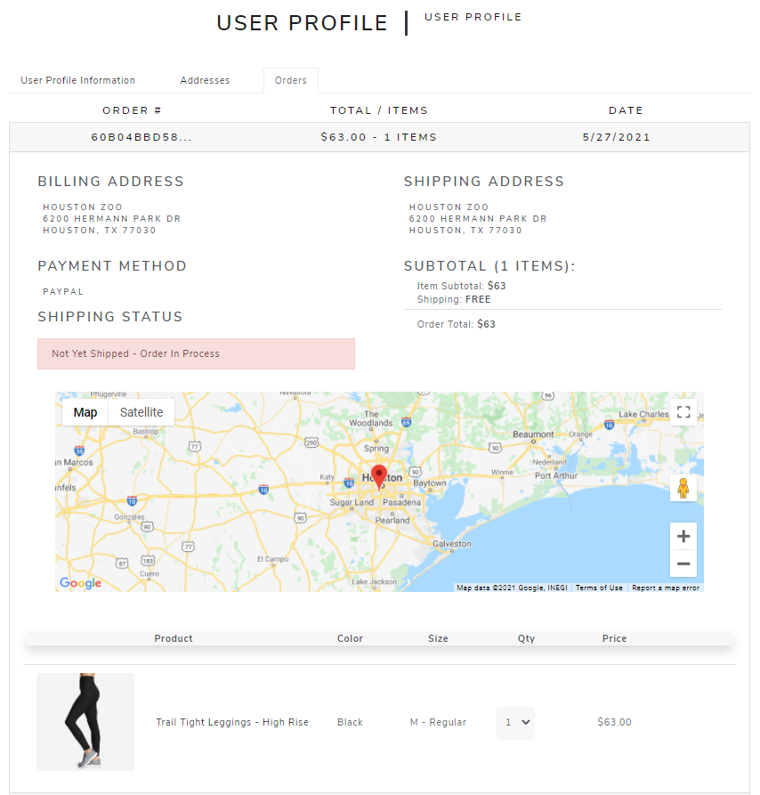

# Go Far Retail Outerwear Website

Go Far is a fully functional retail website built with the MERN stack. It is heavily inspired by EddieBauer.com. Users can search for and browse products, 
add them to their cart or wishlist, and conduct transactions via the PayPal API

 

See the live website [here](https://gofarapp.herokuapp.com/)

### Built With
Frontend | Backend
------------ | -------------
React | MongoDB
Redux | Mongoose
React Bootstrap | Express
 &nbsp; | Node

**Google Maps API**, **JWT (JSON Web Tokens)**, and **bcrypt** are used by both the frontend and backend.  
For an exhaustive list of all libraries used see the frontend [package.json](/frontend/package.json) and the backend [package.json](/package.json)

### Features
*RESTful API*
- Go Far is built on a RESTful API. All CRUD operations use some combination of GET, PUT, POST, and DELETE http requests to the server

*Robust Product Model*
- A robust product [model](/backend/models/productModel.js) allows the database to store products with many different sizes, colors, size categories (petite, tall, plus, etc.), along with unique prices and images for each possible combination
- An example of a product based on this model is shown below:

  

 

- This same product on the [Eddie Bauer website](https://www.eddiebauer.com/p/23151062/women's-guide-pro-pants?sp=1&color=Dusty%20Sage&size=)
 

*Authentication with bcrypt*
- User authentication is handled with bcrypt

*Athorization Middleware using JWT (JSON Web Tokens)*
- When users log in a JSON Web Token is created
- Athorization middleware looks for that token when users try to access protected routes

  

 

*Dynamic Product Image Carousel*
- Images populate based on the colors selected by the user
- Hovering over the featured image gives users a zoom in view of the product
- This was acomplished using [Pure React Carousel](https://github.com/express-labs/pure-react-carousel) by Express Labs
- Some products have videos and are included in the carousel. Clicking the video opens a modal that plays an embedded YouTube video

  

 

*Frontend and Backend Pagination*
- The Go Far server sends paginated data to the frontend when displaying products, reviews, and orders
- For example, the orders section of the User Profile page requests and is sent the data for five orders at a time and no more. As users interact with the pagination buttons more orders are sent as needed
- See the getUserOrders() function in [orderController.js](/backend/controllers/orderController.js)

  

 

*Product Reviews*
- Users can add product reviews
- If they've purchased the product the review will be marked as "Verified Purchase"
- A user's rating immediately counts toward the products total rating and total reviews
- A warning message is displayed if users try to review a product they have already reviewed

  

 

*Search Functionality*
- Users can search for product names or for broader product categories like "camping" and "leggings"

  

 

*User Profiles*
- Users can change their name, email, phone number and passwords
- Users can add, edit, and delete their addresses
- Users can browse their order history and see a Google Map of their shipping address

  

  

  

 

*User Wishlist*
- Users can add products to their wishlist. From there they can delete them or move them to the cart
- If an item is already in their cart the wishlist will display that to the user

  

 

*Cart*
- Users can add and remove items from their cart, change the quantities, save the item for later, or move them to their wishlist (if it's not already in it)
- The cart checks to see if the items are still in stock and if any quantity changes are needed. Out of stock items are automatically saved for later. Any changes to the cart are relayed to the user

  

 

  

 

*Checkout*
- Users can place orders using the PayPal API and PayPal's sandbox mode. The PayPal API script is not mounted to the Body until needed
- Users can add shipping and/or billing addresses if needed during the checkout process

  

 

*Google Maps*
- Backend - During the final stages of the checkout process the user's shipping address is Geocoded (turned from an address into a pair of latitude and longitude coordinates that will be used by the frontend) and saved with the rest of the order
- Frontend - Using the Google Maps Javascript SDK, a map of the user's shipping address is shown for each order. The Google Maps script is not mounted to the Body until needed

Checkout all these features on the live website [here](https://gofarapp.herokuapp.com/)
 

